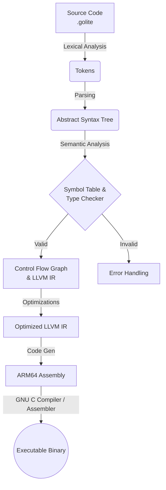

# CompileAndGo

**CompileAndGo** is a comprehensive compiler built in Go that translates a C-like programming language (Golite) into executable ARM64 assembly. It utilizes LLVM Intermediate Representation (IR) generation, Control Flow Graph construct, and a 2SAT-based framework for optimizations.

## Abstract Architecture

The project represents a full compilation pipeline, from source text to executable binaries on macOS ARM64. 



## Compiler Stages Deep Dive

### 1. Lexical Analysis and AST Parsing (`lexer/`, `parser/`, `ast/`)
The compiler begins by using a lexer to map raw source text into discrete tokens. These tokens are fed into a predictive recursive-descent parser generated by ANTLR to construct an **Abstract Syntax Tree (AST)**. The AST abstracts away syntactic minutiae, representing the structure of the Golite program via native Go recursive structures (`Node`, `Expression`, `Statement`), acting as the foundation for semantic evaluation.

### 2. Semantic Analysis (`sa/`)
The **Semantic Analyzer** strictly enforces the language specification by traversing the AST. It is fundamentally responsible for:
- **Symbol Table Construction**: Binding identifiers to their lexical scopes (Global, Struct, Function, Local Block). It resolves shadow variables safely.
- **Type Checking**: Validating that all expressions evaluate to type-safe constructs (e.g., preventing integer additions to structures, validating function parameter signatures, and verifying explicit returns). Unsafe constructs trigger compiler panics, preventing bad code generation.

### 3. IR Generation & SSA Construction (`ir/mem2reg.go`)
Once semantically verified, the AST is translated into a **Control Flow Graph (CFG)** comprising basic blocks of linear **LLVM Intermediate Representation (IR)**. 
To construct a robust **Static Single Assignment (SSA)** form, the compiler implements a complete `mem2reg` optimization pass:
- **Identify Promotable Allocas**: Scans the IR for local stack variables (`alloca`) that are safe to lift into SSA virtual registers.
- **Dominance Frontiers**: Computes the iterative dominance frontier for blocks defining a promotable variable to identify exactly where divergent control flows merge.
- **Phi-Node Insertion**: Inserts $\phi$-nodes at these merge points to synthesize a single version of the merged variables.
- **Renaming Step**: Conducts a top-down dominator-tree traversal, renaming variables (`x_1`, `x_2`) based on the lexical stacks.

### 4. Advanced Optimizations
The compiler operates heavily on the SSA IR to execute critical optimizations before backend traversal.

#### Liveness Analysis (`ir/liveness.go`)
Before allocating physical registers, the compiler computes the exact span where every virtual register is explicitly "alive".
- It linearizes the CFG using **Reverse Post-Order (RPO)** traversal.
- Resolves backwards iterative dataflow equations (`LiveOut[b] = U (LiveIn[s]) for all s in succ(b)`).
- Constructs precise contiguous **Live Intervals** consisting of Start and End instruction positions for each virtual register definition and use.

#### Linear Scan Register Allocation (`ir/allocator.go`)
To efficiently map the unbounded SSA virtual registers into the finite Apple Silicon physical registers, the compiler utilizes a **Linear Scan Register Allocator**:
- It maintains an **Active List** of registers currently holding live intervals, sorted by their expiration times.
- As new variables enter their live intervals, the allocator assigns free physical registers (from a predefined pool like `x19` to `x28`).
- Upon saturation (register pressure), the allocator executes a **Spill Strategy**, identifying the active register with the furthest-away end date, spilling it onto the stack memory, and granting the freed register to the immediate requirement.

#### Out-of-SSA Translation (`ir/out_of_ssa.go`)
Because native Assembly does not inherently support instantaneous parallel $\phi$-node assignments, the compiler must resolve the SSA constraints:
- **Critical Edge Splitting**: The CFG is scrutinized for critical edges (flows from a block with multiple successors to a block with multiple predecessors). Synthetic blocks are inserted here to prevent edge-case assignment collisions.
- **Phi-Demotion**: $\phi$-nodes are structurally demoted into ordered `MOV` instructions securely nested at the explicit end of the defining predecessor blocks.

#### 2SAT Dead Code Elimination
Leveraging a robust theoretical framework, the compiler implements a sophisticated **Dead Code Elimination (DCE)** pass using a **2-Satisfiability (2SAT)** formulation. It mathematically maps the dependencies of each definition as logical propositions. By solving the strong connectivity within the implication graph, the compiler strictly identifies unreachable nodes and systematically prunes universally silent execution paths prior to Assembly.

### 5. ARM64 Code Generation (`arm/`)
The final backend phase dictates the lowering of the non-SSA IR into precise native **AArch64 (ARM64) assembly instructions**.
- Formats Apple Silicon macOS conventions including explicit structural labels (e.g., `_main`), explicit Data and BSS initializations, and necessary memory alignment (`.p2align 2`, `.p2align 3`).
- Tracks deep stack computations (`sp`-offsets) automatically determining precise sizes for frame preservation arrays (handling prologue `stp x29, x30, [sp, #-16]!` and specific epilogues).
- Granularly maps LLVM operations (e.g., `add`, `cmp`, `br`) to direct physical ARM64 CPU instructions using the pre-allocated physical registers outputted from the allocator pass.

---

## Build Instructions

To build the compiler from source:

```bash
$ source build.sh
```
*Note: This script will generate the ANTLR lexer/parser formats and build the `glc` binary directly.*

## Usage Instructions

The `glc` executable accepts `.golite` source files and several flags.
Target defaults to `arm64-apple-macosx14.0.0` (macOS Apple Silicon).

```bash
# Compile and generate native ARM64 assembly (the .s file)
$ ./glc -S filename.golite

# Dump the Lexer tokens
$ ./glc -l filename.golite

# Dump the Abstract Syntax Tree (AST)
$ ./glc -ast filename.golite

# Output the stack-based LLVM IR (.ll) instead of native assembly
$ ./glc -llvm-stack filename.golite
```

### Running the Output

Once the assembly `.s` file is generated, you can use the standard Mac GNU C Compiler (`gcc`/clang) to assemble and link the executable:

```bash
$ gcc filename.s -o filename_bin
$ ./filename_bin
```

## Testing

You can utilize Go's built-in testing commands to run the provided benchmark directories:

```bash
$ go test -v ./testing/... 2>&1 | grep -E "AST output mismatch|Diff at line|Expected:|Got:"
$ go test -v ./testing/ast_test.go
$ go test -v ./testing/sa_test.go
```
