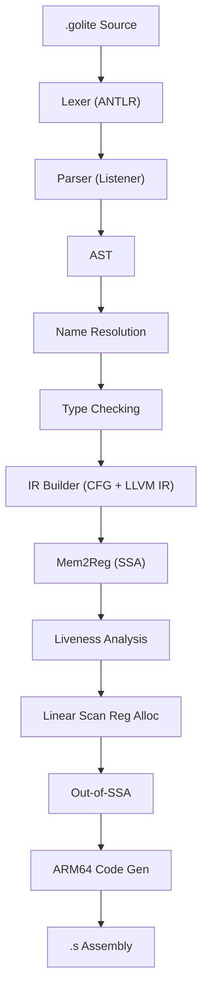

# CompileAndGo

A compiler for **Golite**, a statically-typed, C-like language, written entirely in Go. The compiler takes `.golite` source files through a full compilation pipeline — lexical analysis, parsing, semantic analysis, LLVM IR generation with SSA construction, optimization passes, and native ARM64 assembly code generation — producing executables for macOS on Apple Silicon.

---

## Table of Contents

1. [Architecture Overview](#architecture-overview)
2. [The Golite Language](#the-golite-language)
3. [Stage 1: Lexical Analysis](#stage-1-lexical-analysis)
4. [Stage 2: Parsing and AST Construction](#stage-2-parsing-and-ast-construction)
5. [Stage 3: Semantic Analysis](#stage-3-semantic-analysis)
6. [Stage 4: LLVM IR Generation](#stage-4-llvm-ir-generation)
7. [Stage 5: SSA Construction via Mem2Reg](#stage-5-ssa-construction-via-mem2reg)
8. [Stage 6: Liveness Analysis](#stage-6-liveness-analysis)
9. [Stage 7: Linear Scan Register Allocation](#stage-7-linear-scan-register-allocation)
10. [Stage 8: Out-of-SSA Translation](#stage-8-out-of-ssa-translation)
11. [Stage 9: ARM64 Code Generation](#stage-9-arm64-code-generation)
12. [Build Instructions](#build-instructions)
13. [Usage](#usage)
14. [Testing](#testing)

---

## Architecture Overview

The compiler follows a classical multi-pass architecture. Each pass is a separate Go package, and the main driver (`golite/golite.go`) orchestrates the pipeline sequentially:



When the `-llvm-stack` flag is passed, the compiler skips the SSA optimization passes (Mem2Reg, Liveness, Register Allocation, Out-of-SSA) and directly outputs a stack-based `.ll` file that can be executed with `lli`.

---

## The Golite Language

Golite is a simplified, statically-typed language defined via an ANTLR grammar (`grammars/GoliteParser.g4`). Below is a complete guide to every language construct with examples.

### Program Structure

Every Golite program is structured as: **type declarations → global variable declarations → function definitions**. A `main` function with no arguments and no return type is the required entry point.

```c
// Type declarations come first
type Point struct {
    x int;
    y int;
};

// Then global variable declarations
var counter int;

// Then function definitions
func main() {
    // statements here
}
```

### Variables

Variables are declared with the `var` keyword. Multiple variables of the same type can be declared on a single line. Variables must be declared before the function body's statements.

```c
func main() {
    var a int;
    var x, y, z int;       // declare multiple variables at once
    var flag bool;

    a = 42;
    x = 10;
    y = 20;
    z = x + y;             // z = 30
    flag = true;
}
```

### Types

Golite supports three kinds of types:

| Type | Description | Example |
|---|---|---|
| `int` | 64-bit signed integer | `var x int;` |
| `bool` | Boolean (`true` / `false`) | `var flag bool;` |
| `*StructName` | Pointer to a user-defined struct | `var p *Node;` |

`nil` is a special value that can be assigned to any struct pointer variable.

### Structs

Structs are user-defined types declared at the top of the program. They are always allocated on the heap with `new` and accessed through pointers. Fields are accessed via dot notation.

```c
type Node struct {
    val  int;
    next *Node;
};

func main() {
    var n *Node;

    n = new Node;         // heap-allocate a Node
    n.val = 42;           // set field
    n.next = nil;         // nil pointer

    printf("val=%d\n", n.val);

    delete n;             // free heap memory
}
```

### Functions

Functions are declared with `func`, can take typed parameters, and optionally return a value. Local variable declarations must come before statements.

```c
func add(a int, b int) int {
    return a + b;
}

func factorial(n int) int {
    var result int;
    if (n <= 1) {
        return 1;
    }
    result = n * factorial(n - 1);
    return result;
}

func main() {
    var sum int;
    sum = add(3, 4);
    printf("sum=%d\n", sum);
    printf("5!=%d\n", factorial(5));
}
```

Functions that don't return a value simply omit the return type:

```c
func greet() {
    printf("hello\n");
}
```

### Conditionals

Golite supports `if`/`else` blocks. The condition must be a boolean expression wrapped in parentheses.

```c
func main() {
    var x int;
    x = 10;

    if (x > 5) {
        printf("x is greater than 5\n");
    } else {
        printf("x is at most 5\n");
    }
}
```

### Loops

The `for` loop repeats its body while a boolean condition is `true`:

```c
func main() {
    var i int;
    i = 0;
    for (i < 10) {
        printf("%d\n", i);
        i = i + 1;
    }
}
```

### Input / Output

`printf` prints formatted output (supports `%d` for integers and `\n` for newlines). `scan` reads an integer from standard input.

```c
func main() {
    var x int;

    scan x;                           // read an int from stdin
    printf("you entered: %d\n", x);   // print it

    // multiple values
    var a, b int;
    a = 10;
    b = 20;
    printf("a=%d b=%d sum=%d\n", a, b, a + b);
}
```

### Heap Management

Structs are allocated with `new` and freed with `delete`. Pointers can be compared to `nil`.

```c
type Point struct {
    x int;
    y int;
};

func NewPoint(px int, py int) *Point {
    var p *Point;
    p = new Point;
    p.x = px;
    p.y = py;
    return p;
}

func main() {
    var pt *Point;
    pt = NewPoint(3, 4);

    if (pt != nil) {
        printf("(%d, %d)\n", pt.x, pt.y);
    }

    delete pt;
}
```

### Expressions and Operators

Golite supports a full set of operators with C-like precedence:

| Precedence | Operators | Description |
|---|---|---|
| Lowest | `\|\|` | Logical OR |
| | `&&` | Logical AND |
| | `==` `!=` | Equality |
| | `>` `<` `>=` `<=` | Relational |
| | `+` `-` | Addition / Subtraction |
| | `*` `/` | Multiplication / Division |
| Highest | `!` `-` (unary) | Logical NOT / Negation |

```c
func main() {
    var a, b int;
    var result bool;
    a = 10;
    b = 20;

    // arithmetic
    printf("sum=%d\n", a + b);
    printf("product=%d\n", a * b);

    // comparison
    result = (a < b) && (b > 15);
    // boolean logic with negation
    result = !(a == b) || (a != 0);
}
```

### Complete Example: Linked List

A full program demonstrating structs, recursion, heap allocation, I/O, and control flow:

```c
type Node struct {
    num  int;
    next *Node;
};

var head *Node;
var tail *Node;

func Add(num int) {
    var newNode *Node;
    newNode = new Node;
    newNode.num = num;
    newNode.next = nil;

    if (head == nil) {
        head = newNode;
        tail = newNode;
    } else {
        tail.next = newNode;
        tail = newNode;
    }
}

func PrintList(curr *Node) {
    var val int;
    if (curr == tail) {
        val = curr.num;
        printf("%d\n", val);
    } else {
        val = curr.num;
        printf("%d\n", val);
        PrintList(curr.next);
    }
}

func main() {
    Add(1);
    Add(2);
    Add(3);
    PrintList(head);
}
```

**Output:**
```
1
2
3
```

The grammar enforces operator precedence through a layered production hierarchy: `expression → boolterm → equalterm → relationterm → simpleterm → term → unaryterm → selectorterm → factor`.

---

## Stage 1: Lexical Analysis

**Package**: `lexer/` | **Grammar**: `grammars/GoliteLexer.g4`

The lexer is generated by **ANTLR v4** from `GoliteLexer.g4`. The grammar defines 53 token rules covering keywords (`type`, `struct`, `func`, `if`, `else`, `for`, `return`, `var`, `printf`, `scan`, `delete`, `new`), operators (`||`, `&&`, `==`, `!=`, `>=`, `<=`, `+`, `-`, `*`, `/`, `!`), delimiters (`{`, `}`, `(`, `)`, `;`, `,`, `.`), literals (`NUMBER`, `STRING`, `TRUE`, `FALSE`, `NIL`), and identifiers (`IDENTIFIER`).

The Go-side wrapper (`lexer/lexer.go`) wraps the generated ANTLR lexer in a `lexerWrapper` struct that:
1. Opens the source file and creates an ANTLR `FileStream`
2. Instantiates the generated `GoliteLexer` and attaches custom error listeners that collect `CompilerError` values with line/column information
3. Produces a `CommonTokenStream` consumed by the parser
4. Offers a `PrintTokens()` method (invoked with `-l`) that iterates through all tokens and prints them in a formatted `Line | Col | TokenType(TokenText)` table

Single-line comments (`//`) and whitespace are discarded via ANTLR channel skip rules.

---

## Stage 2: Parsing and AST Construction

**Package**: `parser/` | **Grammar**: `grammars/GoliteParser.g4` | **AST nodes**: `ast/`

Parsing is performed by the ANTLR-generated `GoliteParser`, driven by the `parserWrapper`. Rather than using ANTLR's visitor pattern, the compiler uses a **listener-based approach** (`parser.go` implements `BaseGoliteParserListener`). ANTLR's `ParseTreeWalkerDefault` walks the concrete parse tree bottom-up, invoking `Exit*` methods on each grammar rule. Each `Exit*` method constructs the corresponding Go AST node:

- **`ExitProgram`**: Builds the root `ast.Program` node containing slices of `TypeDecl`, `VarDecl`, and `FuncDecl`.
- **`ExitTypeDeclaration`**: Creates `ast.TypeDecl` with the struct name and its `Field` list.
- **`ExitDeclaration`**: Handles `var x, y, z int;` multi-variable declarations, creating a `VarDecl` with a list of `Variable` expression nodes.
- **`ExitFunction`**: Assembles `ast.FuncDecl` with parameters, local declarations, statements, and the return type (defaulting to `void` if omitted).
- **Statement handlers**: `ExitAssignment`, `ExitPrint`, `ExitRead`, `ExitDelete`, `ExitConditional`, `ExitLoop`, `ExitReturn`, `ExitInvocation` — each constructs the corresponding AST statement node.
- **Expression handlers**: The parser reconstructs operator precedence in-order. For example, `ExitExpression` chains `boolterm` children with `||` operators into nested `BinOp` nodes. This cascades through `ExitBoolterm` (for `&&`), `ExitEqualterm` (for `==`/`!=`), `ExitRelationterm` (for `>`/`<`/`>=`/`<=`), `ExitSimpleterm` (for `+`/`-`), `ExitTerm` (for `*`/`/`), `ExitUnaryterm` (for `!`/`-`), and `ExitSelectorterm` (for `.` field access), finally bottoming out at `ExitFactor` which handles literals, identifiers, function calls, `new` expressions, and parenthesized sub-expressions.

Each node is stored in a `map[string]interface{}` keyed by `"line,column"` so that parent listeners can retrieve children by their source position. Every AST node carries a `token.Token` with source coordinates for error reporting.

The `ast/` package defines the full node hierarchy: `Program`, `TypeDecl`, `VarDecl`, `FuncDecl`, `Field`, `Variable`, `LValue`, `BinOp`, `UnaryOp`, `IntLit`, `BoolLit`, `NilLit`, `Allocate`, `Call`, `Selector`, `Assignment`, `Print`, `Read`, `Delete`, `Conditional`, `Loop`, `Return`, `Invocation`.

---

## Stage 3: Semantic Analysis

**Package**: `sa/` | **Symbol Tables**: `symboltable/` | **Type System**: `types/`

Semantic analysis runs in two sequential passes over the AST:

### Pass 1: Name Resolution (`resolver.go`)

The `NameResolver` populates a hierarchical symbol table structure:

- **`SymbolTable[T TypeEntry]`** is a generic, linked-list-scoped table. Each table has a `parent` pointer. `Contains()` walks up the parent chain, implementing lexical scoping. `Insert()` checks only the current scope for redeclarations.
- **`SymbolTables.Globals`** is the top-level scope containing `StructEntry`, `VarEntry`, and `FuncEntry` objects.
- Each `FuncEntry` has its own `LocalST` (child of `Globals`) containing its parameters and local variables.
- Each `StructEntry` has a `LocalST` containing its field definitions.

The resolver processes declarations in order — types first, then global variables, then functions — mirroring the grammar's `program → types declarations functions` structure. For each function, it inserts parameters and local variables into the function's local symbol table, then recursively resolves all statements and expressions against that scope. It enforces:

- No redeclaration of identifiers within the same scope
- All referenced variables, struct types, and functions must be previously declared
- A `main` function must exist, take no arguments, and return `void`

### Pass 2: Type Checking (`typechecker.go`)

The `TypeChecker` traverses the AST a second time, assigning and validating types:

- **Variable types** are resolved by looking up identifiers in the symbol table and setting the AST node's `Ty` field.
- **Binary operators**: Arithmetic (`+`, `-`, `*`, `/`) requires both operands to be `int` and yields `int`. Comparisons (`>`, `<`, `>=`, `<=`) require `int` operands and yield `bool`. Equality/inequality (`==`, `!=`) requires matching types, with special handling for `nil` comparisons against struct pointers. Logical operators (`&&`, `||`) require `bool` operands.
- **Unary operators**: `!` requires `bool`, `-` requires `int`.
- **Struct field access (`LValue` chains)**: The type checker walks through dotted field accesses (`a.b.c`) by resolving each segment against the struct's field list in the global symbol table, yielding the innermost field's type.
- **Function calls**: Argument count and types are validated against the function's parameter signature.
- **Statements**: Assignment validates LHS/RHS type compatibility (with `nil`-to-struct-pointer coercion). `printf` requires `int` arguments matching `%d` placeholders. `scan` requires an `int` target. `delete` requires a struct pointer. `if`/`for` conditions must be `bool`. `return` values must match the function's declared return type.
- **Return path analysis**: `StmtGuaranteesReturn` checks that all control flow paths in non-void functions terminate with a `return`. An `if/else` guarantees a return only if both branches guarantee a return.

The type system (`types/types.go`) uses singleton patterns (`IntTySig`, `BoolTySig`, etc.) for primitive types and maps (`StructTySig`, `FunctionTySig`) for named types, with structural equality via the `Equals()` interface method.

---

## Stage 4: LLVM IR Generation

**Package**: `ir/` — `builder.go`, `visitor.go`, `instruction.go`, `block.go`, `function.go`, `global.go`

The IR builder takes the type-checked AST and symbol tables and produces a **Control Flow Graph (CFG)** of **LLVM-compatible IR instructions** organized into basic blocks.

### CFG Construction

Each function becomes an `ir.Function` containing a list of `BasicBlock`s. The builder starts each function with an `"entry"` block, then processes statements:

- **Conditionals** (`if`/`else`): Generate three new blocks — `trueL`, `falseL`, and `joinL`. The current block emits a `CondBranch` instruction. Each branch's statements are emitted into their respective blocks, with fallthrough `Branch` instructions to `joinL`.
- **Loops** (`for`): Generate three new blocks — `condL`, `bodyL`, and `exitL`. The current block branches to `condL`, which evaluates the condition and conditionally branches to `bodyL` or `exitL`. `bodyL` falls through back to `condL`.

### Instruction Set

The IR defines a typed instruction set closely mirroring LLVM:

| Instruction | Description |
|---|---|
| `Alloca` | Stack-allocates space for a local variable, produces a pointer register |
| `Store` | Writes a value to a pointer address |
| `Load` | Reads a value from a pointer address into a register |
| `BinaryOp` | Arithmetic/logical operations: `add`, `sub`, `mul`, `sdiv`, `and`, `or`, `xor` |
| `Icmp` | Integer comparison: `eq`, `ne`, `sgt`, `sge`, `slt`, `sle` |
| `Branch` | Unconditional jump to a labeled block |
| `CondBranch` | Conditional jump based on an `i1` value |
| `Call` | Function call with arguments, optional result register, variadic support |
| `Return` | Function return with optional value |
| `Gep` | `getelementptr` — computes struct field addresses by index offset |
| `Bitcast` | Reinterprets pointer types (used for `malloc`/`free` casts) |
| `Phi` | SSA φ-node merging values from predecessor blocks (inserted by Mem2Reg) |
| `Mov` | Pseudo-move instruction (inserted by Out-of-SSA to replace φ-nodes) |

### Variable Handling

In the initial (pre-SSA) IR, all local variables and parameters are `alloca`'d on the stack. Parameters are stored into their stack slots immediately upon function entry. Every read goes through a `Load`, every write through a `Store`. Global variables are referenced by `@name` constants.

### Printf/Scanf Handling

The builder maintains a `fmtStrings` map to deduplicate format strings. Each unique format string becomes a global constant array (e.g., `@.fmt0 = private constant [4 x i8] c"%d\0A\00"`). `printf` and `scanf` calls use `getelementptr` to produce an `i8*` pointer to the format string, then issue a variadic `call`.

### Heap Allocation

`new StructName` compiles to a `call @malloc(i32 <size>)` where size is `numFields * 8`, followed by a `bitcast` from `ptr` to the struct pointer type. `delete` compiles to a `bitcast` back to `ptr` followed by `call @free(ptr)`.

### Output

The builder writes the complete IR to a `.ll` file including: `source_filename`, `target triple`, `%struct.*` type declarations, global variable definitions, function definitions with labeled basic blocks, and external declarations for `malloc`, `free`, `scanf`, and `printf`.

---

## Stage 5: SSA Construction via Mem2Reg

**File**: `ir/mem2reg.go`

The Mem2Reg pass transforms the stack-based IR into **Static Single Assignment (SSA)** form, which is essential for subsequent optimization passes. The implementation follows the standard SSA construction algorithm:

### Step 1: Build the CFG Edges

`buildCFG` analyzes the terminator instruction of each basic block (`Branch`, `CondBranch`, `Return`) and populates `Successors` and `Predecessors` lists, establishing the graph structure needed for dominance computation.

### Step 2: Identify Promotable Allocas

`identifyPromotable` scans each function's entry block for `Alloca` instructions. An alloca is promotable if all its uses are simple `Load`/`Store` instructions operating directly on the alloca'd register (no address escapes, no complex pointer arithmetic). Each promotable alloca is mapped from its register ID to the original variable name.

### Step 3: Pre-scan Scanf Targets

`prescanScanfTargets` identifies cases where `scanf` writes directly into a promotable alloca. These need special handling because `scanf` performs a *store through a pointer* — the pass rewrites these to store into a dedicated global scratch variable and then loads the result back.

### Step 4: Iterative Dataflow for φ-Node Insertion

`ssaDataflow` is the core of the pass. For each promotable variable, it performs a fixed-point iteration over the CFG:

1. Initializes an `inMap` (the reaching definition at the start of each block) and a `phiMap` (φ-nodes at each block entry) for every variable.
2. For each block, simulates execution: walks instructions sequentially, tracking the current value of each promotable variable. When a `Store` to a promotable alloca is encountered, the variable's value is updated. When a `Load` from a promotable alloca is encountered, the current value is recorded.
3. At block boundaries, propagates values to successor blocks. If a variable has different reaching values from different predecessors, a φ-node is inserted (or updated) at the successor's entry.
4. Repeats until no `inMap` or `phiMap` entries change (fixed-point convergence).

### Step 5: Rewrite the Function

`rewriteFunction` performs the actual transformation:

1. Removes all `Alloca`, `Store`, and `Load` instructions that operated on promotable variables.
2. Replaces all references to loaded values with the SSA-renamed values computed by the dataflow pass.
3. Inserts the φ-node instructions at the beginning of appropriate blocks.
4. Handles edge cases like `scanf` targets by rewriting them to use the global scratch variable.

After Mem2Reg, every local variable exists purely in virtual registers with a unique definition point, enabling the register allocator and other optimizations to work directly on the SSA IR.

---

## Stage 6: Liveness Analysis

**File**: `ir/liveness.go`

The liveness pass computes **Live Intervals** for every virtual register, determining the exact range of instructions during which each register holds a needed value. This information is consumed by the register allocator.

### CFG Linearization

`linearizeCodeRPO` performs a **Reverse Post-Order (RPO)** traversal of the CFG using DFS. This produces a linear ordering of basic blocks that respects the natural flow of execution (a block is visited before its successors, except for loop back-edges). Each instruction is assigned a sequential position number in this linear order.

### Block-Level Liveness

`buildBlockLiveness` computes per-block `use` and `def` sets by iterating through each instruction with `parseInstUsesAndDefs`:
- A register is **used** if it appears as an operand before being defined in the same block
- A register is **defined** if it appears as the result of an instruction

Then it runs the standard **iterative backward dataflow** to compute `LiveIn` and `LiveOut` sets:

```
LiveOut[B] = ∪ LiveIn[S], for all successors S of B
LiveIn[B]  = Use[B] ∪ (LiveOut[B] − Def[B])
```

The iteration runs bottom-up (from the last block to the first) and repeats until neither `LiveIn` nor `LiveOut` changes for any block.

### Live Interval Construction

`buildLiveIntervals` walks every instruction and tracks the first definition (Start) and last use (End) position for each register. It then extends intervals for registers that are live-out at block boundaries — if a register is in `LiveOut[B]`, its interval end is extended to at least the last instruction position in block `B`.

The result is a list of `LiveInterval{ID, Start, End}` structures ready for the register allocator.

---

## Stage 7: Linear Scan Register Allocation

**File**: `ir/allocator.go`

The register allocator maps the unbounded set of SSA virtual registers to a finite set of physical AArch64 registers using the **Linear Scan** algorithm.

### Physical Register Pool

The allocator defines a pool of available registers:
```
x0, x1, x2, x3, x4, x5, x6, x7, x8,     (caller-saved / argument registers)
x11, x12, x13, x14, x15,                   (caller-saved temporaries)
x19, x20, x21, x22, x23, x24, x25, x26, x27, x28  (callee-saved)
```

Registers `x9`, `x10` are reserved as scratch registers for the ARM code generator. `x29` (frame pointer) and `x30` (link register) are managed by function prologues/epilogues.

### Algorithm

1. **Sort** all live intervals by their Start position.
2. Maintain an **Active List** of intervals currently assigned to physical registers, sorted by End position.
3. For each new interval `i`:
   - **Expire old intervals**: Remove intervals from the Active List whose End is before `i.Start`, returning their physical registers to the free pool.
   - If **free registers are available**: Assign the first free register and add `i` to the Active List.
   - If **no free registers** (register pressure): **Spill** — compare `i` with the active interval that ends last. If the active interval ends later, it is spilled (its register is reassigned to `i`). Otherwise, `i` itself is spilled.
4. After allocation, `mutateRegisterAllocations` walks every instruction in the function and annotates each `Register` with its assigned physical register string (e.g., `[x19]`) or `[SPILLED]`.

---

## Stage 8: Out-of-SSA Translation

**File**: `ir/out_of_ssa.go`

Before generating assembly, the SSA form must be deconstructed because hardware cannot execute φ-nodes. The Out-of-SSA pass performs two transformations:

### Critical Edge Splitting (`splitCriticalEdges`)

A **critical edge** is an edge from a block with multiple successors to a block with multiple predecessors. These edges are problematic because inserting a `MOV` instruction on such an edge would affect other paths. The pass identifies all critical edges and inserts a new intermediate block containing only an unconditional `Branch`. All φ-node references and successor/predecessor lists are updated to route through the new block.

### φ-Demotion (`demotePhis`)

Each φ-node `%r = phi [v1, pred1], [v2, pred2], ...` is replaced by inserting a `MOV %r, vi` instruction at the end of each predecessor block `predi` (just before the terminator). The φ-node itself is then removed from the block. Because critical edges were split first, each predecessor block has at most one successor that uses this φ value, guaranteeing correctness.

After this pass, the IR contains only non-SSA instructions (`MOV` instead of `Phi`) and can be directly lowered to assembly.

---

## Stage 9: ARM64 Code Generation

**Package**: `arm/` — `builder.go`, `translator.go`, `instruction.go`

The ARM code generator takes the post-allocation, non-SSA IR and emits native **AArch64 assembly** targeting macOS Apple Silicon.

### Assembly Structure

The output `.s` file is organized into three sections:
- **`.data`**: Initialized global data (format strings as `.asciz` directives)
- **`.bss`**: Uninitialized global variables (8-byte `.space` allocations with `.globl` visibility and `.p2align 3` alignment)
- **`.text`**: Function code with `.globl` visibility, `.p2align 2` alignment, and Apple symbol prefixing (`_main` instead of `main`)

### Function Prologue/Epilogue

Each function follows the ARM64 calling convention:

**Prologue**:
1. `stp x29, x30, [sp, #-16]!` — Save frame pointer and link register
2. `mov x29, sp` — Establish new frame pointer
3. `sub sp, sp, #<stackSize>` — Allocate stack frame (computed as `maxRegisterID * 8`, rounded up to 16-byte alignment)
4. `str x0..x7, [x29, #-offset]` — Spill incoming arguments to the stack
5. `stp x19..x28` — Save callee-saved registers in pairs

**Epilogue**:
1. `ldp x27..x19` — Restore callee-saved registers (reverse order)
2. `mov sp, x29` — Deallocate frame
3. `ldp x29, x30, [sp], #16` — Restore frame pointer and link register
4. `ret` — Return to caller

### Instruction Translation (`instruction.go`)

Each IR instruction is translated to one or more ARM64 instructions:

| IR Instruction | ARM64 Translation |
|---|---|
| `BinaryOp(add/sub/mul/sdiv)` | `add`/`sub`/`mul`/`sdiv` with register operands. Immediate operands are first loaded into scratch registers when required by the instruction encoding. |
| `Icmp` | `cmp` followed by `cset` with the appropriate condition code (`eq`/`ne`/`gt`/`ge`/`lt`/`le`) |
| `Branch` | `b .Lfunc_label` |
| `CondBranch` | `cmp cond, #0` then `b.ne trueLabel` then `b falseLabel` |
| `Call` | Arguments moved to `x0..x7`. On Apple platforms, variadic arguments beyond the first are passed on the stack with explicit `sub sp` / `str` / `add sp` sequences. The function is called via `bl _funcname`. Results are captured from `x0`. |
| `Store` | `str src, [dst]` — globals are accessed via `adrp`/`add` page-relative addressing |
| `Load` | `ldr dst, [src]` — same global addressing scheme |
| `Gep` | `add dst, ptr, #(index * 8)` — struct field access via offset arithmetic |
| `Alloca` | `sub dst, x29, #(regID * 8)` — compute stack slot address |
| `Return` | Moves the return value to `x0`, then `b .Lfunc_end` to reach the epilogue |
| `Bitcast`/`Mov` | `mov dst, src` — type-level reinterpretation that becomes a simple register move |

### Global Variable Access (Apple Silicon)

Global variables on macOS use **ADRP + ADD** with `@PAGE` / `@PAGEOFF` relocations:
```asm
adrp x9, _myGlobal@PAGE
add  x9, x9, _myGlobal@PAGEOFF
ldr  x0, [x9]
```

---

## Build Instructions

**Prerequisites**: Go 1.21+, Java (for ANTLR grammar generation), LLVM tools (`lli` for stack-mode testing), and a C compiler (`gcc` or `clang`).

```bash
# Build the compiler (generates ANTLR lexer/parser and compiles the glc binary)
$ source build.sh
```

## Usage

The `glc` binary accepts `.golite` source files. The default target is `arm64-apple-macosx14.0.0`.

```bash
# Generate ARM64 assembly
$ ./glc -S program.golite
# Assemble and run
$ gcc program.s -o program && ./program

# Generate stack-based LLVM IR (no optimizations)
$ ./glc -llvm-stack program.golite
# Execute via LLVM interpreter
$ lli program.ll

# Print lexer tokens
$ ./glc -l program.golite

# Print the AST
$ ./glc -ast program.golite

# Specify a custom target triple
$ ./glc -target="aarch64-linux-gnu" -S program.golite
```

## Testing

The `build.sh` script includes diff-based validation against expected outputs for the included benchmark programs:

```bash
# Run all benchmark tests
$ source build.sh

# Run Go unit tests
$ go test -v ./testing/...
```

Benchmarks include: `binarytree`, `hard`, `linkedlist`, `mixed`, `powmod`, `primes`, `primes2`, `thermopylae`, `Twiddleedee`, and `arm`.
